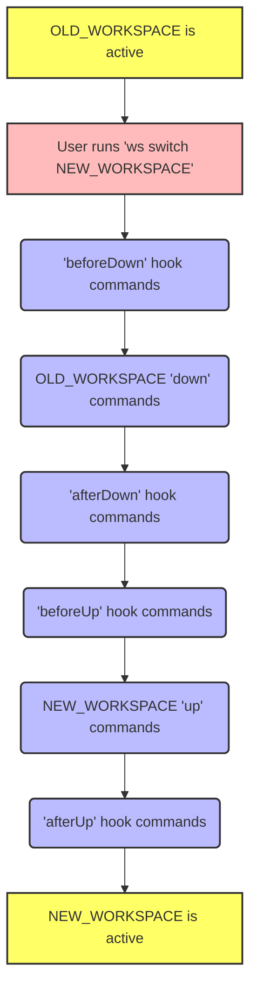

# ws

Workspace Switcher: a tool to switch between shell contexts

## Order of execution

```mermaid
graph TD
  A[OLD_WORKSPACE is active] --> B[User runs 'ws switch NEW_WORKSPACE']
  B --> C('beforeDown' hook commands)
  C --> D(OLD_WORKSPACE 'down' commands)
  D --> E('afterDown' hook commands)
  E --> F('beforeUp' hook commands)
  F --> G(NEW_WORKSPACE 'up' commands)
  G --> H('afterUp' hook commands)
  H --> I[NEW_WORKSPACE is active]

  classDef state fill:#ff6,stroke:#333,stroke-width:2px;
  classDef action fill:#fbb,stroke:#333,stroke-width:2px;
  classDef execution fill:#bbf,stroke:#333,stroke-width:2px;
  class A,I state
  class B action
  class C,D,E,F,G,H execution
```
